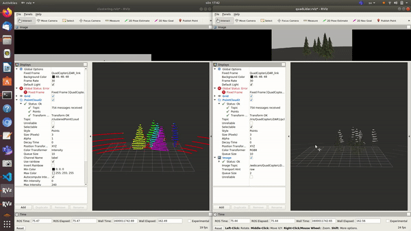
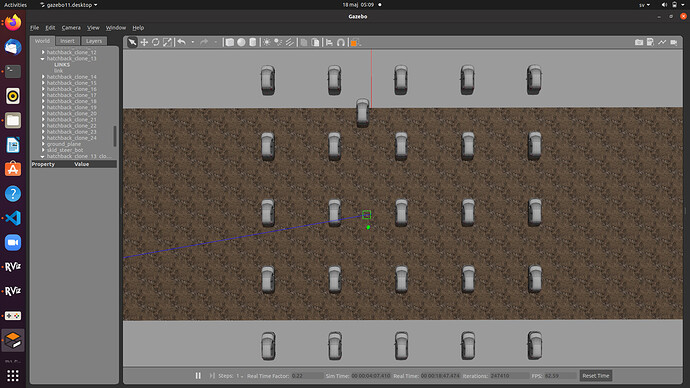
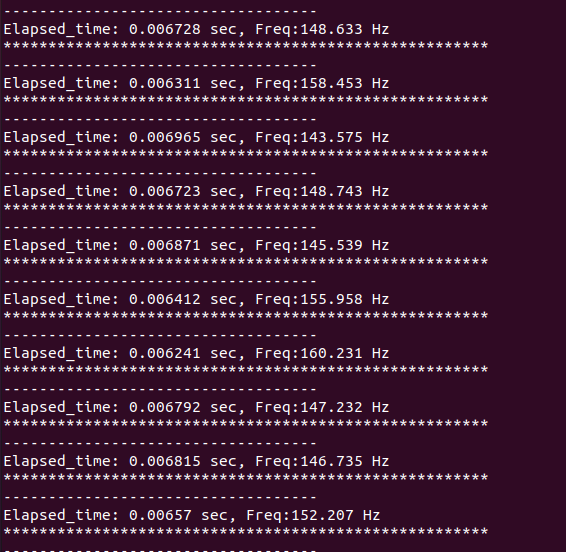
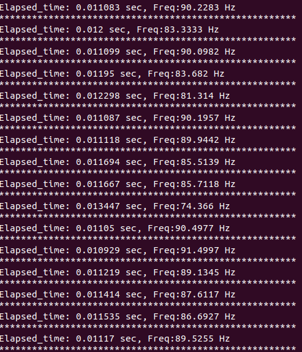
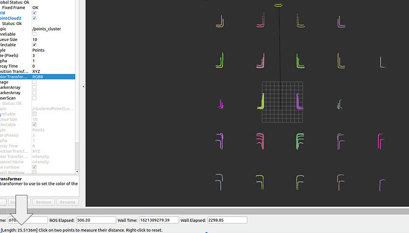
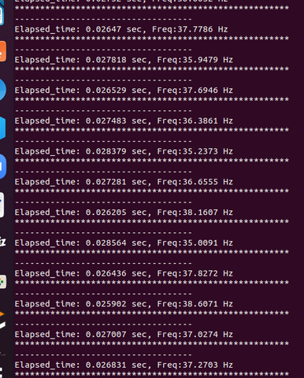
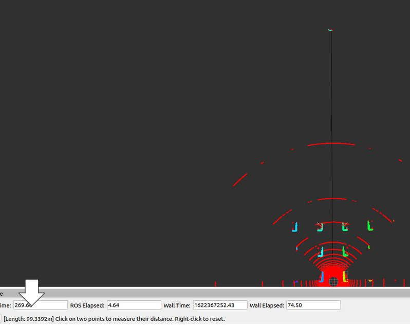
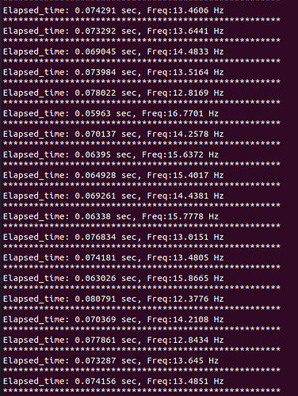
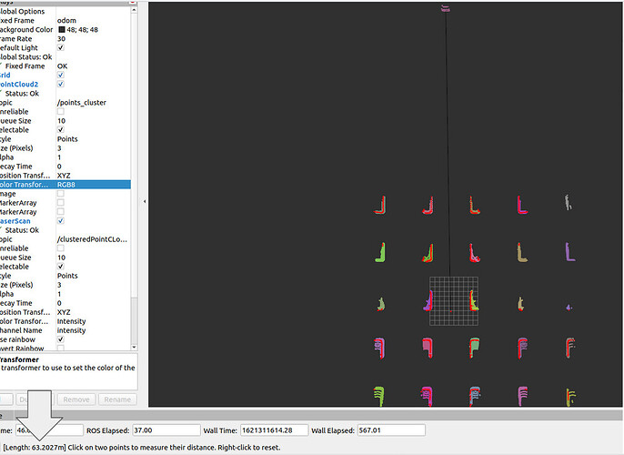

# sgm_lidar_clustering
LiDAR clustering algorithm based on the assumption of LiDAR as a sphirical, designed to subscribe a pcl::PointXYZRGB point cloud,and publish a clustered pcl::PointXYZRGBL point cloud.

SGM LiDAR clustering act only on sorted ordered set of points, and doesn't act on unsorted points, or downsampled point clouds.

# Features:

- [x] Semantic Clustered Point Cloud Encoded in pcl::PointXYZRGBL.
- [x] FreeSpace Encoded in sensor_msgs::LaserScan.
- [x] Clustered Objects are filtered based on size constrains.
- [x] Objectlevel detections Encoded in visualization_msgs::MarkerArray Message.

# Requirements:
Required packages:

* OpenCV
* PCL

# Build: 

        caktin build sgm_lidar_lidar_clustering

# RUN:

clone and build **gazebo_ros_package** and **ModuLiDAR Gazebo Ros LiDAR Plugin**.

to run the Clustering Node for Velodyne(Single Sensor):

                roslaunch sgm_lidar_lidar_clustering Cluster_node.launch 
or for multi benwake sensor:

                roslaunch sgm_lidar_lidar_clustering multi_node_benwake.launch 

# Benwake LiDAR clustering Demo:

image below represent benwake LiDAR clustering

and the below image shows how it looks in simulation

# Velodyne16 LiDAR clustering Demo:

image below represent Veldoyne16 LiDAR clustering

and the below image shows how it looks in simulation

# Benchmarking on Raspberry Pi:

you can download ros_bags from:

        wget https://www.dropbox.com/s/yzl5eceb7j4qxlq/benwake_farm.bag

or

        wget https://www.dropbox.com/s/srb028hw6i85zwl/velodyne_farm.bag

rpi setup:

* ubuntu 20
* ros noetic

clone and build ModuLiDAR, and run the launch files:

        roslaunch gazebo_simulator modulidar_rpi_replay.launch rosbag_path:='path_to_bag_files' sensor:=<velodyne/benwake>

raspberry pi for velodyne16
setup:
* rosbag publish tf, tf_static, velodyne point cloud sensor.
* roscore master runs on raspberry pi.
* velodyne sensor point cloud is 16 layer, each layer has 2048 points, 32768 scan points in total.
*  velodyne input frequency is 10hz, output clustered point cloud is 10 hz.
* clustering algorithm runs in 20 to 23 hz( 2x to 2.3x required speed). 
* rviz just for visualizing what is happening on rpi, rviz runs on pc.

raspberry pi for two benwake sensor CE30C
setup:
* rosbag publish tf, tf_static, left and right benwake point cloud sensors.
* roscore master runs on raspberry pi.
* each benwake sensor is 24 layer, each layer has 320 points, 7680 scan points in total.
*  benwake input frequency is 30 hz, output clustered point cloud is 30 hz.
* clustering algorithm runs in 70 to 100 hz( 2.3x to 3.3x required speed). 
* rviz just for visualizing what is happening on rpi, rviz runs on pc.

# Benchmarking:
Benchmarking between SGM clustering and lidar_euclidean_cluster_detect in autoware.

## Simulation test rig setup:
test rig is an array of cars setup in a 5x5 grid each grid with a distance of 10 meters between each cone, and the robot is in the middle of it
as shown in the below figure.

## Sensor model:
we used two sensors first is 16 layer velodyne sensor, second is 64 layer velodyne sensor, to measure the change of point cloud density on the detection algorithms.

## ModuLiDAR setup:
clone the repo and “catkin build”
will set two sets of configurations:

* “use_morphological_filter” = false.
* “ground_segmentation_threshold” = 0.1

## Autoware setup:
Follow the setup guide and build the lidar_euclidean_cluster_detect package.
will set two sets of configurations:

* “remove_ground” = true.
* “keep_lanes” = false.
* “clip_min_height” = -5.
* “clip_max_height” = 5.
* “output_frame” = 3.
* “downsample_cloud” = true.

     

## KPIs:
the KPI that we think fit the most is range of detection, as both are detection algorithms, so simply how far can each algorithm can detect, and how the frequency will be.

## Experiment1:

* velodyne16-SGM algorithm with ground segmentation threshold of 0.1

### result:

SGM effective detection range around 48m, detection frequency beween 143 and 160 hz

* velodyne16-euclidean algorithm with downsample = true

### result:
effective detection range 25.5m, detection frequency between 74 and 90 hz

## Experiment2:

* velodyne64-SGM algorithm with ground segmentation threshold of 0.1

### result:
effective detection range around 99.3m(max range), detection frequency beween 35 and 38 hz

* velodyne64-euclidean algorithm with downsample = true
### result:
effective detection range around 63.2m, detection frequency beween 12 and 15 hz

# Conclusion:

* SGM V2 clustering ~2x longer range than euclidean clustering in velodyne 16 and ~1.57x longer detection range in velodyne 64.
* SGM V2 better in performance than euclidean clustering in velodyne16 by around 66%~84%, and in velodyne64 by around 150%~190%.
* SGM is losless, doesnot lose pointcloud textures or downsample it, euclidean clustering requires downsampling to actually work, which may result to a deformation or object splitting into multiple objects.
* SGM provides freespace euclidean clustering doesn’t, euclidean clustering provides pose estimation, SGM doesn’t.