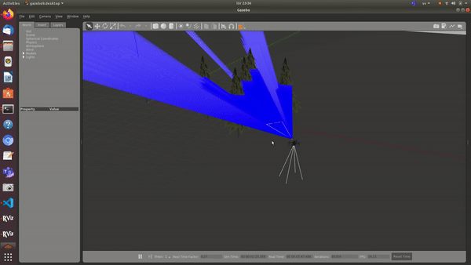
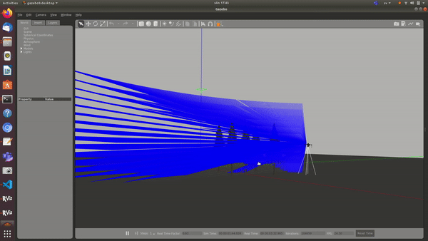

# sgm_lidar_clustering
LiDAR clustering algorithm based on the assumption of LiDAR as a sphirical, designed to subscribe a pcl::PointXYZRGB point cloud,and publish a clustered pcl::PointXYZRGBL point cloud.

SGM LiDAR clustering act only on sorted ordered set of points, and doesn't act on unsorted points, or downsampled point clouds.

# Features:

- [x] Semantic Clustered Point Cloud Encoded in pcl::PointXYZRGBL.
- [x] FreeSpace Encoded in sensor_msgs::LaserScan.
- [x] Clustered Objects are filtered based on size constrains.
- [x] Objectlevel detections Encoded in visualization_msgs::MarkerArray Message.

# Requirements:
Required packages:

* OpenCV
* PCL

# Build: 

        caktin build sgm_lidar_lidar_clustering

# RUN:

clone and build **gazebo_ros_package** and **Autobotware Gazebo Ros LiDAR Plugin**.

to run the Clustering Node for Velodyne(Single Sensor):

                roslaunch sgm_lidar_lidar_clustering Cluster_node.launch 
or for multi benwake sensor:

                roslaunch sgm_lidar_lidar_clustering multi_node_benwake.launch 

# Benwake LiDAR clustering Demo:

image below represent benwake LiDAR clustering

and the below image shows how it looks in simulation

# Velodyne16 LiDAR clustering Demo:

image below represent Veldoyne16 LiDAR clustering

and the below image shows how it looks in simulation

# Benchmarking on Raspberry Pi:

you can download ros_bags from:

        wget https://www.dropbox.com/s/yzl5eceb7j4qxlq/benwake_farm.bag

or

        wget https://www.dropbox.com/s/srb028hw6i85zwl/velodyne_farm.bag

rpi setup:

* ubuntu 20
* ros noetic

clone and build Autobotware, and run the launch files:

        roslaunch autobotware_simulator autobotware_rpi_replay.launch rosbag_path:='path_to_bag_files' sensor:=<velodyne/benwake>

raspberry pi for velodyne16
setup:
* rosbag publish tf, tf_static, velodyne point cloud sensor.
* roscore master runs on raspberry pi.
* velodyne sensor point cloud is 16 layer, each layer has 2048 points, 32768 scan points in total.
*  velodyne input frequency is 10hz, output clustered point cloud is 10 hz.
* clustering algorithm runs in 20 to 23 hz( 2x to 2.3x required speed). 
* rviz just for visualizing what is happening on rpi, rviz runs on pc.

raspberry pi for two benwake sensor CE30C
setup:
* rosbag publish tf, tf_static, left and right benwake point cloud sensors.
* roscore master runs on raspberry pi.
* each benwake sensor is 24 layer, each layer has 320 points, 7680 scan points in total.
*  benwake input frequency is 30 hz, output clustered point cloud is 30 hz.
* clustering algorithm runs in 70 to 100 hz( 2.3x to 3.3x required speed). 
* rviz just for visualizing what is happening on rpi, rviz runs on pc.

